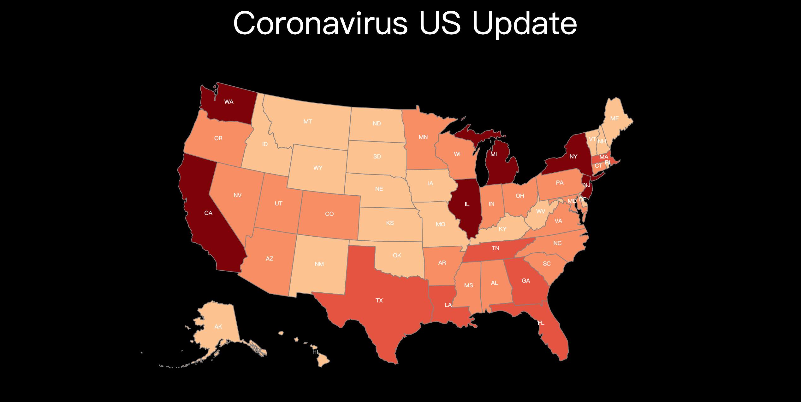
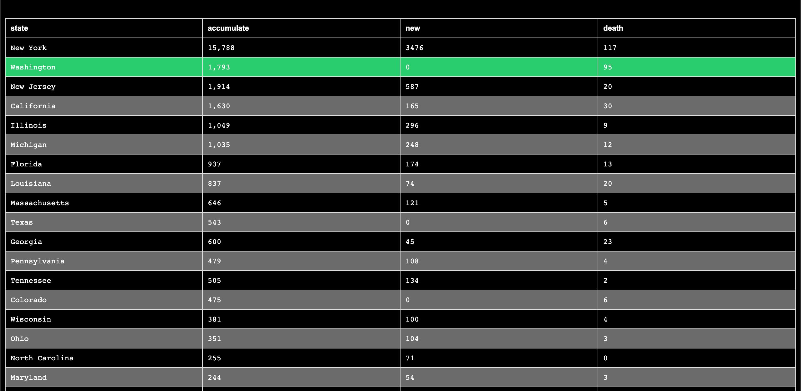

# This is a visualization for current coronavirus status in the US.
## Link to website: https://coronavirus-us-map.herokuapp.com/
## Techniques
1. Python Flask
2. D3.js
## Data
[News Break Coronavirus Data](https://www.newsbreak.com/topics/covid-19)
## Screenshots

